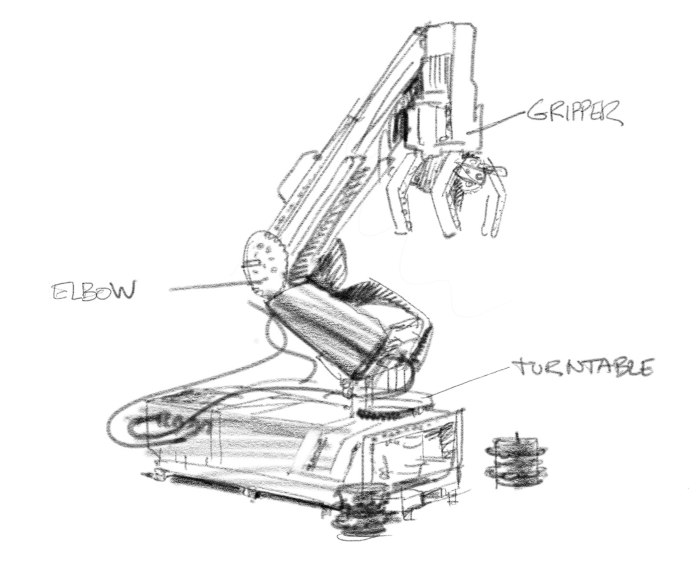

Robot Arm H25
=====================

This example program makes the robot (:numref:`fig_robot_arm`) move the black wheel hub stacks around forever. The robot arm will first initialize and then start moving the hubs around.

You can find building instructions for the robot on the `LEGO Education website <https://le-www-live-s.legocdn.com/sc/media/lessons/mindstorms-ev3/building-instructions/ev3-model-core-set-robot-arm-h25-56cdb22c1e3a02f1770bda72862ce2bd.pdf>`_.

Tip: When building the robot, reverse the orientation of the EV3 Brick such that the microSD card is easily accessible.

.. _fig_robot_arm:

   Robot Arm H25

.. literalinclude:: ../../../examples/ev3/robot_arm_h25/main.py
