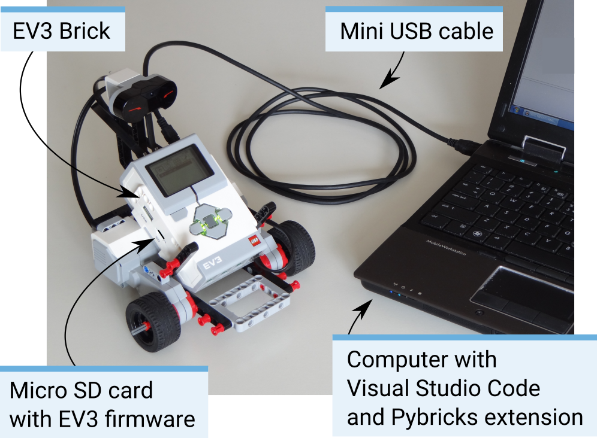

Installation
===================

This page guides you through the steps to collect and install everything you need to start programming.

What do you need?
-----------------------------------------------------------

To get started, you'll need:

- A Windows 10 or Mac OS computer
- Internet access and administrator access

    This is required during the installation only. You will not need special access to write and run programs later on.

- A microSD card

    You'll need a card with a minimum capacity of 4GB and a maximum capacity of 32GB. This type of microSD cards is also known as microSDHC. We recommend cards with Application Performance Class A1.

- A microSD card slot or card reader in your computer

    If your computer does not have a (micro)SD card slot, you can use an external USB (micro)SD card reader.

- A mini-USB cable, like the one included with your EV3 set

The typical configuration of this equipment is summarized in the figure below.

Preparing your computer
-----------------------------------------------------------

You'll write your MicroPython programs using Visual Studio Code. Follow the steps below to download, install, and configure this application:

1. Download `Visual Studio Code <https://code.visualstudio.com/Download>`_.
2. Follow the on-screen instructions to install the application.
3. Launch Visual Studio Code.
4. Open the extensions tab as shown below.
5. Install and activate the required extension:

.. figure:: images/store.png
    :alt: store
    :align: center
 
    Installing the extension from the Visual Studio Code marketplace

.. _prepsdcard:

Preparing the microSD card
-----------------------------------------------------------

To make it possible to run MicroPython programs on your EV3 brick, you'll now learn how to install the required tools on your microSD card.

If the microSD card contains files you want to keep, make sure to create a backup of its contents first. See :ref:`managing files on the EV3 <managefiles>` to learn how to backup your previous MicroPython programs if necessary.

*This process erases everything on your microSD card, including any previous MicroPython programs on it.*

To install the MicroPython tools on your microSD card:

1. Download the `EV3 MicroPython microSD card image <.>`_ and save it in a convenient location. This file is approximately 360 MB. Do **not** open or unzip the file.
2. Download and install a microSD card flashing tool such as `Etcher <https://www.balena.io/etcher/>`_.
3. Insert the microSD card into your computer or card reader.
4. Launch the flashing tool and follow the steps on your screen to install the file you have just downloaded. If you use Etcher, you can follow the instructions in the diagram below:

    a. Select the EV3 MicroPython microSD card image file you have just downloaded.
    b. Select your microSD card. Make sure that the device and size correspond to your microSD card.
    c. Start the flashing process. This may take several minutes. Do not remove the card until the flashing process is complete.

.. figure:: images/etcher.png
   :width: 85 %
   :alt: etcher
   :align: center

   Using Etcher to flash the EV3 MicroPython microSD card image

Updating the microSD card
-----------------------------------------------------------

To update the microSD card, download a new image file using the link above and flash it to the microSD card as described above. Be sure to :ref:`back up any MicroPython programs you want to save <managefiles>`.

You do not need to erase the contents of the microSD card first. This is done automatically when you flash the new image file.

Using the EV3 brick
-----------------------------------------------------------

Make sure the EV3 brick is turned off. Insert the microSD card you prepared into the microSD card slot on the EV3 brick, as shown below.

.. figure:: images/sd.png
   :width: 75 %
   :alt: sd
   :align: center

   Inserting the flashed microSD card into the EV3 brick

Turning the EV3 brick on and off
^^^^^^^^^^^^^^^^^^^^^^^^^^^^^^^^^^^^^^^^^^^^^^^^^^^^^^^^^^^

Turn on the EV3 brick by pressing the dark gray center button.

The boot process may take several minutes. While booting, the EV3 brick status light turns orange and blinks intermittently, and you'll see a lot of text on the EV3 screen. The EV3 brick is ready for use when the status light turns green.

To turn the EV3 brick off, open the shutdown menu with the back button, and then select *Power Off* using the center button, as shown below.

.. figure:: images/onoff.png
   :width: 65 %
   :alt: devicebrowser
   :align: center

   Turning the EV3 brick off

Viewing motor and sensor values
^^^^^^^^^^^^^^^^^^^^^^^^^^^^^^^^^^^^^^^^^^^^^^^^^^^^^^^^^^^

When you're not running a program, you can view motor and sensor values using the device browser, as shown below.

.. figure:: images/devicebrowser.png
   :width: 100 %
   :alt: devicebrowser
   :align: center

   Viewing motor and sensor values

Going back to the original firmware
^^^^^^^^^^^^^^^^^^^^^^^^^^^^^^^^^^^^^^^^^^^^^^^^^^^^^^^^^^^

You can go back to the LEGO® firmware and your LEGO programs at any time. To do so:

1. Turn the EV3 brick off as shown above.
2. Wait for the screen and brick status light to turn off.
3. Remove the microSD card.
4. Turn the EV3 on.
