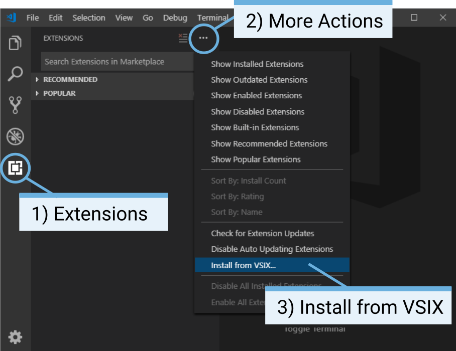

Installation
===================

This page shows how you prepare your computer and the EV3 brick for writing and running Python programs. The final configuration is shown in the figure below.

.. figure:: images/overview.png

.. Caption

What do you need?
-----------------------------------------------------------

To get started writing Python programs for your robot, you need the following items:

- a Windows 10 or Mac OS computer
- a micro SD card and card reader
- a mini-USB cable (comes with the EV3 kit)

You'll need internet access to complete the steps on this page. While programming your robots afterwards, internet access is not required.

Preparing your computer
-----------------------------------------------------------

.. warning::

    The download links below do not work yet. Please follow the instructions provided separately.

You will be writing your Python programs using Visual Studio Code. You can download, install, and configure this program using the steps below.

1. Download, install, and open `Visual Studio Code  <https://code.visualstudio.com/Download>`_.
2. Download the `Pybricks extension <.>`_. Follow the steps in the diagram below to install it.
3. Download the `EV3 Python extension <.>`_. Follow the steps in the diagram below to install it.
4. Close Visual Studio Code and open it again to activate the extensions.

Preparing the SD Card
-----------------------------------------------------------

You will now follow a series of steps to download and install the EV3 Python firmware onto your micro SD card.

1. Download the `EV3 Python firmware <.>`_ and save it in a convenient location. Do *not* unzip the file.
2. Download and install `Etcher <https://www.balena.io/etcher/>`_. This is the program for installing the firmware file on your micro SD card.
3. Insert the micro SD card into your computer or card reader.
4. Launch the etcher program and follow the steps on your screen to install the firmware file you have just downloaded. Do not remove the card until the installation process is complete.
5. Turn the EV3 brick off if it is currently on.
6. Put the micro SD card in the SD card slot of the EV3 brick.

Using the EV3 brick
-----------------------------------------------------------

Turning the EV3 brick on and off
^^^^^^^^^^^^^^^^^^^^^^^^^^^^^^^^^^^^^^^^^^^^^^^^^^^^^^^^^^^

Using the file browser
^^^^^^^^^^^^^^^^^^^^^^^^^^^^^^^^^^^^^^^^^^^^^^^^^^^^^^^^^^^

Viewing motor and sensor values
^^^^^^^^^^^^^^^^^^^^^^^^^^^^^^^^^^^^^^^^^^^^^^^^^^^^^^^^^^^
