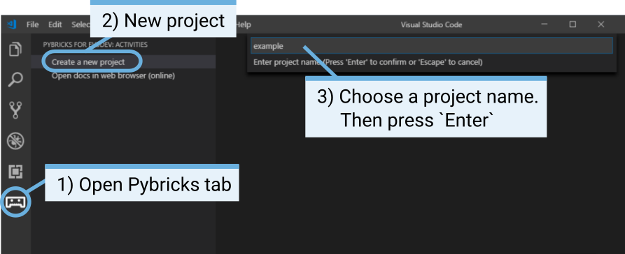
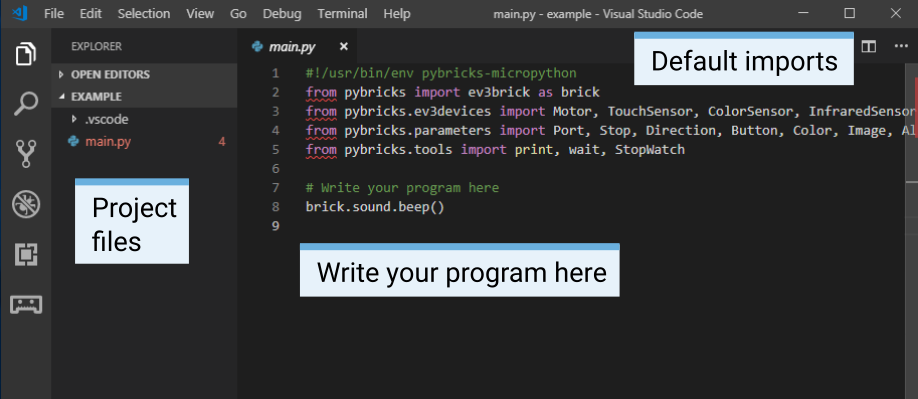
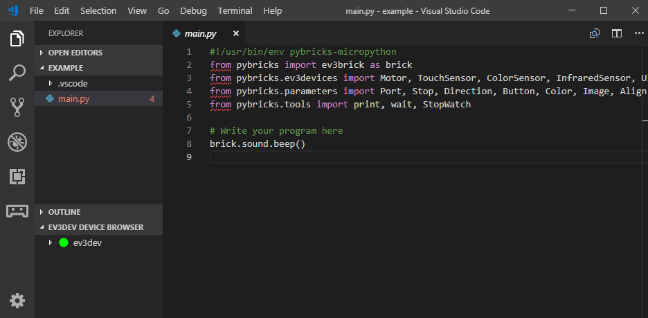
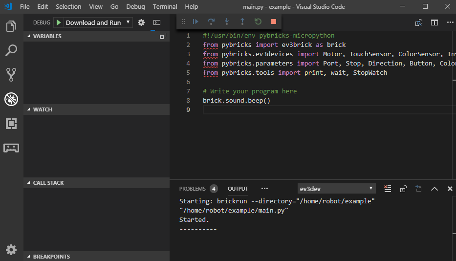

Creating and running programs
=============================

Now that you've set up your computer and your EV3 brick, you're ready to start writing programs.

Programs are organized into *project folders*, as shown below. A project folder is a directory on your computer that contains the main program (**main.py**), and other optional scripts or files. This project folder and all of its contents will be copied to the EV3, where the main program will be run.

This page shows you how to create such a project and how to transfer it to the EV3.

.. figure:: images/projectstructure.png
   :width: 100 %
   :alt: alt
   :align: center

   A project contains a program called **main.py** and optional resources like sounds or MicroPython modules.

Creating a new project
-----------------------------------------------------------

To create a new project, open the Pybricks tab and click *create a new project*. Enter a project name in the text field that appears, and press *Enter*. When prompted, choose for a location for this program and confirm by clocking *choose folder*. This is summarized in the diagram below.

   Creating a new project. This example is called *getting_started*, but you can choose any name.

When you create a new project, it already includes an example *main.py* file that you can modify and extend. To see its contents and to modify it, open it from the file browser as shown below.

If you are new to MicroPython programming, we recommend that you keep the existing code in place, and write your own code below it.

   Opening the default *main.py* program.

Setting up the connection
-----------------------------------------------------------

You'll now learn how to transfer your project to the EV3 brick and run the main program. 

First, make sure that your EV3 is turned on and that it is connected to your computer. Then, follow the steps below to configure the connection.

   Configuring the connection between the computer and the EV3

Downloading and running a program
-----------------------------------------------------------

You can press the F5 key to run your program. Alternatively, you can start it manually by going to the *debug* tab, and clicking the green start arrow, as shown below.

When the program starts, a pop up toolbar allows you to stop the program if necessary. If your program produces any output, this is shown in the output window.

   Running a program

Expanding the example program
-----------------------------------------------------------

Now that you've run the basic code template, let's expand the program to make a motor move. First, attach a Large Motor to Port B on the EV3 brick, as shown below.

.. figure:: images/firstprogram.png
   :width: 100 %
   :alt: alt
   :align: center

   The EV3 brick with a Large Motor attached to port B.

Next, edit *main.py* such that looks like this:

.. literalinclude:: ../../examples/ev3/getting_started/main.py

When you run the program, you'll hear a beep, the motor rotates, and you'll hear another higher pitched beep.

.. _managefiles:

Managing files on the EV3
-----------------------------------------------------------

After you've downloaded a project to the EV3, you can run, delete, or back up programs stored on the EV3, as shown in the diagram below.

.. figure:: images/files.png
   :width: 100 %
   :alt: alt
   :align: center

   The EV3 brick with a Large Motor attached to port B.

Running a program without a computer
-----------------------------------------------------------

After you've downloaded your project to your EV3 brick, you can restart it even when it is not connected to a computer. To do so, find the file using the *file browser* and use the *Enter* key to start the program.

.. figure:: images/manualrun.png
   :width: 100 %
   :alt: alt
   :align: center

   Starting a program using the buttons of the EV3 brick
